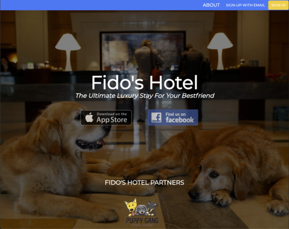

## Fido's Hotel

- A hotel booking application for your dog while you're away on your travels. Features full login & sign-up authorization using JWT.
- Final project for GA-1207

### Technologies Used:

- React
- MongoDB
- Express
- Nodejs

### Images:

- Homepage screenshot of application

### User Stores:

A user simply creates an account, adds their dog and dog's information, updates their profile if they wish and then can create booking appointments for their dog.

### Future Features:

- API Integration for local pet stores and current weather based on user's location.
- Image upload functionality.
- Admin dashboard privileges and employee privileges to edit bookings on user's pets.
- More share funcationality between social media applications.
- Drag & Drop for bookings on your dog(s).
- Deployment

### Shoutouts:

Instructional team of SEI-1207:

- Kenny Bushman
- Milcah Orbacedo
- Quin Sparks
- Michael Solorio

---

Also shoutout to some of my cohort mates who I've worked with and shared some great laughs & memories with:

- Mohamed Abdulah
- Brittany Bui
- Matt Biggers
- Nicholas Gacicia
- Abe Abdulah
- Sennad Binghalib
- Scott Johnson
- Josh Waldman
- Jessica Hansen
